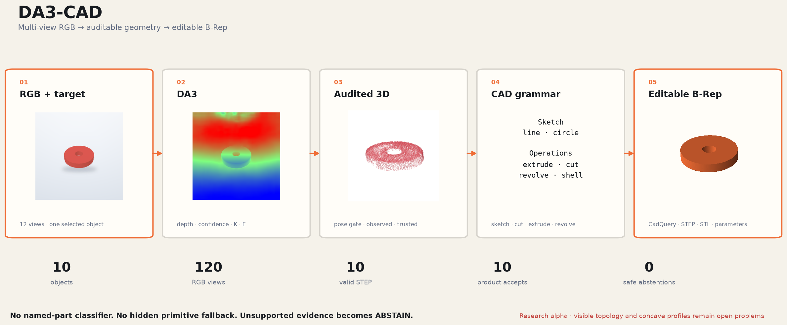
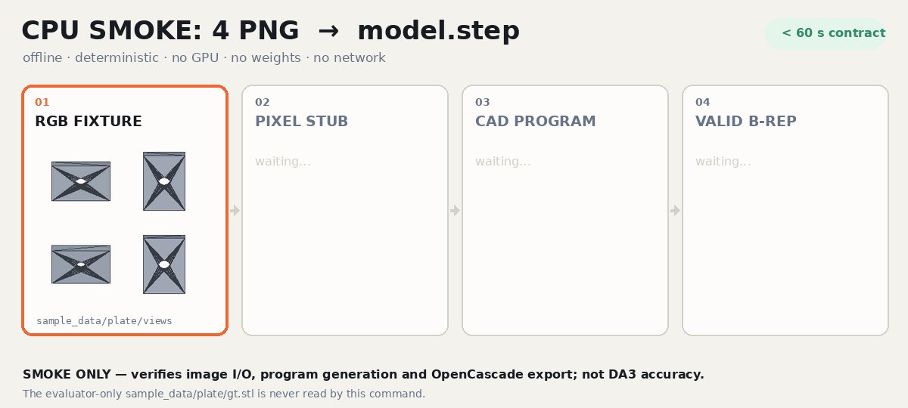
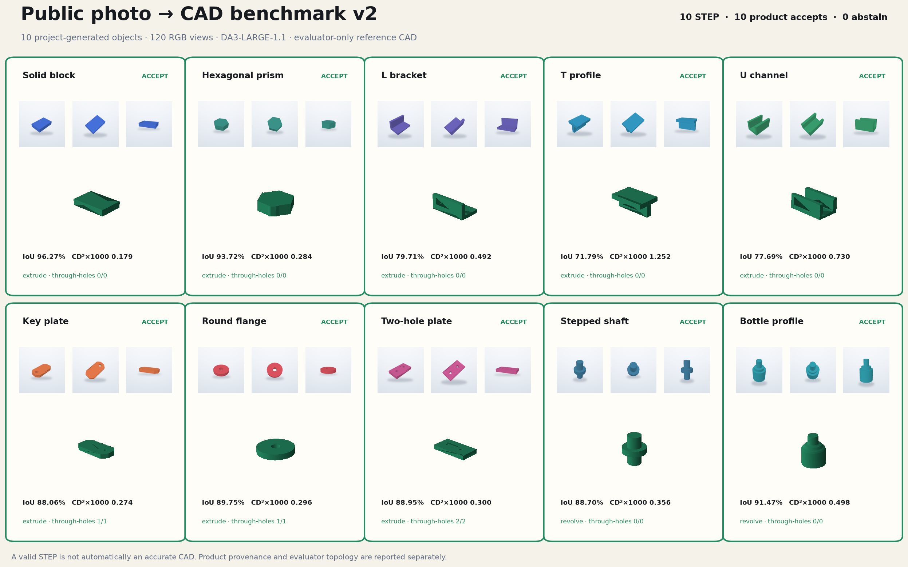

# DA3-CAD

[](https://github.com/dancher00/DA3-CAD/actions/workflows/ci.yml)
[](https://www.python.org/)
[](LICENSE)
[](#status)





**DA3-CAD turns multiple photographs of one selected object into an editable
CadQuery program, a validated STEP solid, STL, dimensions and an audit trail.**
[Depth Anything 3](https://github.com/ByteDance-Seed/Depth-Anything-3) provides
depth, confidence and camera hypotheses; a deterministic CAD grammar recovers
sketches and operations. Unsupported evidence returns `ABSTAIN` instead of a
hidden nearest-template fallback.

> Research alpha: this is coarse reverse engineering, not automatic recovery of
> the original feature tree, tolerances or manufacturing intent.

## Quick start

### CPU smoke: bundled PNGs to STEP

From a source checkout on Ubuntu with CPython 3.12:

```bash
git clone https://github.com/dancher00/DA3-CAD.git
cd DA3-CAD
conda create --prefix ./.venv python=3.12 pip -y
conda activate "$PWD/.venv"
python -m pip install -r constraints/cpu-py312.txt
python -m pip install --no-deps -e .

da3-cad cpu-smoke --output outputs/cpu-demo
# -> outputs/cpu-demo/model.step
```

The final command uses exactly four tracked images from `sample_data/plate/views`,
requires no GPU, weights or network, and has a tested 60-second end-to-end budget
(the local reference run took under two seconds). It deliberately uses labelled,
pixel-derived stub backends: this proves image I/O, sandboxed CadQuery execution
and valid OpenCascade STEP export, **not DA3 reconstruction accuracy**. The
evaluator-only `sample_data/plate/gt.stl` is not read. Rebuild the animation with
`python scripts/build_cpu_smoke_gif.py`.

### Full DA3 reconstruction

Requirements: an NVIDIA CUDA GPU and preferably 8–24 ordered views of one
stationary object. An RTX 5080 16 GB runs the default model; an H100 mainly
reduces inference time. Starting from the CPU environment above:

<details>
<summary>Add DA3/GPU dependencies and verified weights</summary>

```bash
python -m pip install -r constraints/cu130-py312.txt
python -m pip install -r constraints/da3-py312.txt
python -m pip install -r constraints/target-py312.txt

python scripts/fetch_da3_source.py
python scripts/fetch_da3_weights.py \
  --profile large-1.1 \
  --accept-noncommercial-weights

# Needed only when boxes must be converted to masks.
python scripts/fetch_sam2_source.py
python scripts/fetch_sam2_weights.py
```

The default DA3-LARGE-1.1 checkpoint is CC BY-NC 4.0. The fetcher shows the
terms, requires explicit acceptance, verifies the full SHA-256 and stores the
weights only under ignored `data/`. No weights are redistributed here.

</details>

#### 1. Select the object

Put the views in `photos/`. Supply one loose `xyxy` box per image in
`boxes.json`; the user-selected object is the target, not a predicted class.

```bash
da3-cad prepare-target photos/ \
  --boxes boxes.json \
  --output captures/my-object \
  --segment-device cuda
```

If source-resolution PNG masks already exist, use `--masks source_masks/`
instead. The exact JSON schema and capture advice are in the
[photo guide](docs/INTERNET_PHOTO_TO_CAD.md).

#### 2. Reconstruct and inspect

```bash
da3-cad doctor captures/my-object/images

da3-cad reconstruct captures/my-object/images \
  --output outputs/my-object \
  --config configs/internet_photo_masked.yaml \
  --masks captures/my-object/masks \
  --accept-noncommercial-weights

da3-cad inspect outputs/my-object
da3-cad viewer outputs/my-object --images captures/my-object/images
```

Pass `--cameras cameras.npz` when calibrated intrinsics/extrinsics are
available. Pass, for example, `--known-dimension extrusion_length=120mm` when
one physical dimension is known. Otherwise units remain
`canonical-model-unit`; millimetres are never invented.

For moving-camera video, first run `da3-cad prepare-video`; the object itself
must remain stationary. See the [video guide](docs/VIDEO_TO_CAD.md).

An accepted reconstruction contains:

```text
outputs/my-object/
├── model.py              editable CadQuery source
├── model.step            primary validated B-Rep solid
├── model.stl             tessellated preview/mesh export
├── parameters.json       editable dimensions and scale evidence
├── quality.json          validity, decision and warnings
├── provenance.json       inputs, versions, cameras and timings
├── report.md
└── artefacts/            depth, masks, geometry and CAD audits
```

## How it works

1. **Target preparation** — a user box becomes a SAM2 mask, or an exact mask is
   accepted directly; every view receives the same context-preserving crop.
2. **DA3 geometry** — DA3 predicts depth, confidence, intrinsics and extrinsics,
   or consumes a verified external camera bundle.
3. **Audited 3D** — pose admission, bounded pose repair and feature-wise view
   admission keep observed depth separate from trusted fitting geometry.
4. **CAD grammar** — line/circle sketches plus `extrude`, `cut`, `revolve`,
   `shell`, `sweep` and `union` hypotheses compete under evidence gates. There
   is no dictionary of named parts.
5. **B-Rep contract** — restricted CadQuery executes in a subprocess; export
   succeeds only for one finite, positive-volume solid. Surface provenance is
   checked independently from kernel validity.

The [architecture](docs/ARCHITECTURE.md) specifies coordinates, camera
conventions, scale, filtering and validation contracts. The
[illustrated algorithm walkthrough](docs/ALGORITHM_RU.md) shows the diagnostic
channels in detail.

## Public benchmark



The release benchmark contains **10 project-generated objects and 120 RGB
views** under Apache-2.0. Every case has exact masks and cameras; reference CAD
is evaluator-only and is never passed to reconstruction.

| Outcome | Count | Meaning |
|---|---:|---|
| Kernel-valid STEP | 10/10 | OpenCascade accepts the emitted solid |
| Product acceptance | 10/10 | the CAD also passes visible surface-provenance gates |
| Provenance rejection | 0/10 | no emitted STEP contradicts the configured visible-evidence gates |
| Safe abstention | 0/10 | every controlled case is explained by the current grammar |
| ≥80% IoU + exact hole topology | 7/10 | evaluator-only surface and topology check |

All four reference through-holes are retained. Mean IoU is 86.61% with every
case kept in the denominator. T/U concave profiles remain the largest fidelity
gaps and L is just below the 80% evaluator gate. A valid, evidence-consistent
STEP is not presented as an accurate reconstruction.

- [Full benchmark report](docs/PUBLIC_BENCHMARK.md)
- [Three-page PDF](docs/DA3-CAD_public_benchmark_v2.pdf)
- [Machine-readable ledger](docs/results/public-benchmark-v2.json)
- [Grammar refinement: before/after and negative controls](docs/results/grammar-refinement-v1.json)
- [Redistributable fixtures](sample_data/public_benchmark_v2/README.md)

Reproduce the fixtures, GPU runs and figures with:

```bash
python scripts/build_public_benchmark_cases.py
python scripts/run_public_benchmark.py
python scripts/build_public_release_assets.py
```

Five pinned Google Objectron Internet-video sequences additionally exercise the
real-photo integration path without reference CAD. Their licensed media are not
redistributed; one current result passes the product gate. See
[results and claim boundaries](docs/RESULTS.md).

## Status

DA3-CAD currently works best for isolated, rigid, matte objects described by a
single extrusion or a simple axial program, with broad viewpoint coverage and a
known target mask. The principal open problems are high-fidelity concave-sketch
recovery, thin/glossy surfaces,
freeform geometry, multi-body assemblies and original design-history recovery.

The next engineering milestone is a constrained line/arc sketch solver followed
by multi-operation and multi-body program composition. Learned program proposal
and ranking can help after those contracts exist; geometric validation remains
deterministic.

## Reproducibility, paper and license

CPU CI runs formatting, lint, strict typing, no-network tests, release hygiene
and wheel/sdist builds. Sources, checkpoints and datasets use pinned revisions
and hashes; every reconstruction records its inputs and software provenance.

- [Reproducibility](docs/REPRODUCIBILITY.md)
- [Third-party licenses](docs/LICENSES.md)
- [Troubleshooting](docs/TROUBLESHOOTING.md)
- [Draft paper](paper/README.md)
- [Proposed Awesome DA3 entry](docs/AWESOME_PR.md)

DA3-CAD source and project-generated fixtures are Apache-2.0. Third-party
models and datasets keep their own terms. Cite the software with
[`CITATION.cff`](CITATION.cff) and cite Depth Anything 3 separately.

Contributions are welcome through [CONTRIBUTING.md](CONTRIBUTING.md).
