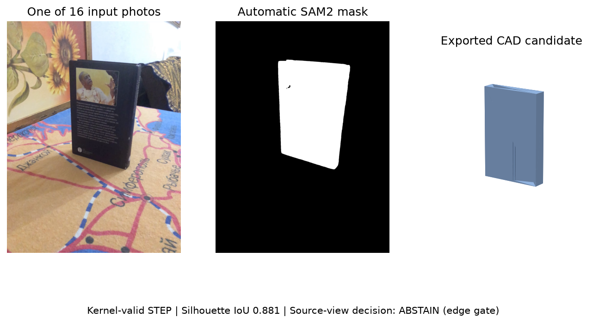

# Datumfold

Previously DA3-CAD.

**Turn photos of an object into editable CAD.** Describe the object, provide overlapping photos, and export STEP, STL and a CadQuery Python program.

[](https://github.com/dancher00/DA3-CAD/actions/workflows/ci.yml)
[](LICENSE)

**Research preview:** CAD drafts can be wrong. The tool reports whether its checks passed; it does not guarantee dimensions, hidden geometry or manufacturing accuracy.



*Actual multi-photo run. A valid STEP was exported, but the source-view edge check failed: **ABSTAIN**. This example used the optional research-only Qwen2.5-VL-3B profile.*

## 1. Install

Linux, Python 3.12 and an NVIDIA GPU. Tested on an RTX 5080 with 16 GB VRAM.

```bash
git clone https://github.com/dancher00/DA3-CAD.git
cd DA3-CAD
```

Follow the **[one-time setup](docs/PHOTO_CAD.md#installation)** to install the environment and models. Weights download separately. The original `da3-cad` command also works.

## 2. Add photos and describe the object

Put **20–40 sharp, overlapping photos of the same stationary object** in `photos/`. Move the camera around it; keep the object still. At least three distinct images are required for reconstruction.

```bash
# Preview the object selection before reconstructing.
datumfold photo-cad photos/ --object "black book" \
  --output work/selection --stop-after-masks --device cuda

# Generate a faster, unverified CAD draft.
datumfold photo-cad photos/ --object "black book" \
  --output work/book --geometry da3 --device cuda
```

Use a **new output folder** for each run. Selection masks are in `work/selection/selection/masks/`. For calibrated reconstruction and source-view checks, see the [full MVS workflow](docs/PHOTO_CAD.md#calibrated-reconstruction).

## 3. Open the result

Open `work/book/candidate.step` in your CAD editor, or create a local browser preview:

```bash
datumfold viewer work/book/cad --output work/book/viewer.html
```

Open `work/book/viewer.html`. Drag to rotate, scroll to zoom, or select **Front**, **Top** and **3D**. Use **Export STEP** to open the model in your CAD editor.


*Browser preview of a separate DA3 book draft. This is an unverified candidate, not the accepted reconstruction of the source object.*

| File / status | What it means |
|---|---|
| `candidate.step`, `.stl`, `.py` | Editable draft, mesh and generating program. |
| `model.step`, `.stl`, `.py` | Exports from an accepted MVS run. |
| `report.json` | Final decision, selected models and stage logs. |
| `CANDIDATE` / `ABSTAIN` | Unverified draft / verification declined acceptance. |
| `ACCEPT` | Passed the implemented checks; physical accuracy is not guaranteed. |

## How it works

**Text + photos → Qwen VLM → Grounding DINO → SAM2 masks → 3D reconstruction → CAD fitting → checks.** Models run locally in stages. Choose DA3 for drafts or calibrated multi-view stereo for the full verification route.

[Usage, setup & troubleshooting](docs/PHOTO_CAD.md) · [RaySection depth-to-CAD tool](docs/RAY_SECTIONS.md) · [Technical report](docs/RaySection_technical_report.pdf) · [Research results & history](docs/RESEARCH_HISTORY.md) · [Image credits](docs/assets/quickstart/README.md)

Code: [Apache-2.0](LICENSE). Third-party models and example images have their own terms; see the [model notes](docs/PHOTO_CAD.md#model-licenses).
