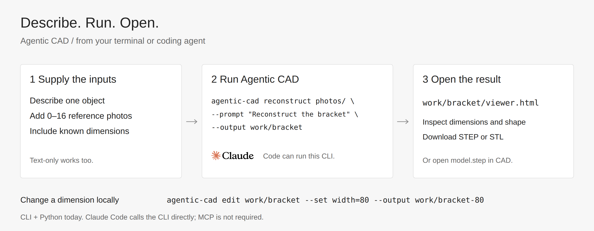

# Agentic CAD

**[Live demo ↗](https://dancher00.github.io/agentic-cad/)** — real photos, prompts and downloadable CAD.

**Text and photos → editable CAD.** Describe a part, add up to 16 reference photos, and get STEP, STL and a parameterized CadQuery program.


## Quick start

Linux · Python 3.12 · GPU recommended for multi-view reconstruction.

```bash
git clone https://github.com/dancher00/agentic-cad.git
cd agentic-cad
python3.12 -m venv .venv
source .venv/bin/activate
pip install -r constraints/cpu-py312.txt
pip install --no-deps -e .
```

Configure `LLMPROXY_API_KEY`, or save your key in `~/.config/llm-proxy/api_key`.
The default is **GPT-5.6 Sol** through the configured [LLM proxy](docs/PHOTO_CAD.md#installation).
For direct OpenAI access, set `OPENAI_API_KEY` and use `--provider openai --model YOUR_MODEL_ID`.

Put reference photos of one object in `photos/`, or start with text only.

```bash
# From a description.
agentic-cad generate --prompt "Plate 60 × 40 × 5 mm, centered 10 mm hole" \
  --output work/plate

# From several views, after the hybrid setup linked below.
agentic-cad reconstruct photos/ --prompt "Reconstruct this bracket" \
  --dimension "height=60mm" --output work/bracket
```

Open `work/bracket/viewer.html` in your browser. Download the STEP, or open `model.step` directly in your CAD editor. Each run needs a new output folder.



## How it works


All selected photos go into the same model request. The model writes a CAD program; local checks build one solid and export it. Invalid code gets up to one repair request by default. Material assignment, FEM and grasp planning run downstream.

Multiple photos automatically use segmentation, joint camera/depth estimation and geometric feedback.
Text and single-photo requests use GPT by default; `--reconstruction gpt` explicitly selects that path.
The [hybrid setup](docs/HYBRID.md) uses COLMAP for camera recovery and SAM2 + DA3
on your GPU, fits estimated CAD
parameters and checks declared cavities against the final solid.
It also compares CAD renders and measured sections with the photos, then
automatically revises features that its review flags as incorrect. One shared CAD is
projected into every estimated camera; the weakest view also contributes to fitting.
See [how to capture multiple views](docs/HYBRID.md#capture-the-object).

## Use it from your software

A CLI and Python function are available today. There is no hosted HTTP API or MCP server yet. Claude Code can invoke the CLI directly; [setup and Python example](docs/INTEGRATION.md).

| Output | Use |
|---|---|
| `model.step` / `model.stl` | CAD and mesh tools |
| `model.py` / `parameters.json` | Edit dimensions |
| `viewer.html` | Offline preview and downloads |
| `report.json` | Run result and provider usage |

[Usage](docs/PHOTO_CAD.md) · [Integration & Claude Code](docs/INTEGRATION.md) · [Validation](docs/BENCHMARKS.md) · [Editable diagrams](docs/assets/workflow/README.md) · [Apache-2.0](LICENSE)

Text and photos are sent to your selected provider. Previewing and editing exported CAD run locally.
