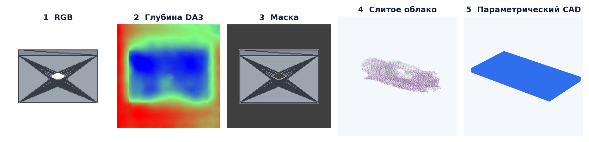
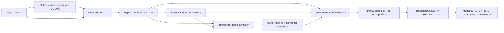

# DA3-CAD

[](https://github.com/dancher00/DA3-CAD/actions/workflows/ci.yml)
[](https://www.python.org/)
[](LICENSE)
[](#current-scope)

**Deterministic multi-view RGB to editable B-Rep CAD with
[Depth Anything 3](https://github.com/ByteDance-Seed/Depth-Anything-3).**

DA3-CAD takes object-centric photographs or a moving-camera video and produces
an executable CadQuery model, one validated STEP solid, STL, editable primary
dimensions, and an auditable reconstruction report. Depth Anything 3 supplies
multi-view geometry; DA3-CAD supplies object masks, fusion, canonicalization,
visual-hull reconstruction, B-Rep generation, validation, and export.



> This is a working **coarse reconstruction** pipeline, not universal reverse
> engineering. It does not recover the original feature tree, invisible
> concavities, fillets, threads, tolerances, assemblies, or manufacturing intent.

## What goes in and what comes out

| Input | DA3 contribution | DA3-CAD contribution | Output |
|---|---|---|---|
| 8–24 RGB views | depth, confidence, intrinsics and extrinsics | segmentation, confidence-gated fusion, canonical orientation, silhouette/depth carving | `model.py`, STEP, STL, parameters, reports |
| Moving-camera video | pose-conditioned depth after key-frame and optional COLMAP preparation | deterministic key-frame selection and the same image pipeline | the same CAD artifacts |
| RGB + external `K/E` | camera-conditioned depth | uses the verified camera bundle instead of relying on free pose estimation | more stable multi-view geometry |
| RGB + masks | depth and cameras | uses exact per-view object support | less segmentation ambiguity |
| Any of the above + one named dimension | geometry remains scale-ambiguous | transfers the accepted dimension to the whole CAD model | dimensions explicitly in millimetres |

A single photograph is accepted by the geometry stack, but hidden shape and
thickness remain underconstrained. Multi-view input is the product path.

## Pipeline



For a pixel `(u,v)` with DA3 z-depth `z`, the geometry core computes
`x_cam = z K⁻¹[u,v,1]ᵀ` and transforms it with the inverse world-to-camera
extrinsic. Points survive only explicit mask, finite-depth, and per-view
confidence gates. The CAD backend retains voxels supported by enough visible
silhouettes, applies conservative front-surface depth carving, keeps one
6-connected component, and covers it with deterministic cuboid features.
Generated CadQuery is checked by an AST policy and executed in a resource-limited
subprocess. Export succeeds only for one finite positive-volume solid.

See [the architecture document](docs/ARCHITECTURE.md) for coordinate, camera,
scale, and validation contracts.

## Quick start

The tested target is Ubuntu, CPython 3.12, and an NVIDIA GPU. RTX 5080 16 GB is
enough for the default 0.35B model; the verified run peaked at 6.02 GB allocated
and 8.67 GB reserved CUDA memory.

```bash
git clone https://github.com/dancher00/DA3-CAD.git
cd DA3-CAD
conda create --prefix ./.venv python=3.12 pip -y
conda activate "$PWD/.venv"

python -m pip install -r constraints/cpu-py312.txt
python -m pip install -r constraints/cu130-py312.txt
python -m pip install -r constraints/da3-py312.txt
python -m pip install --no-deps -e .

python scripts/fetch_da3_source.py
python scripts/fetch_da3_weights.py \
  --profile large-1.1 \
  --accept-noncommercial-weights
```

The default refreshed `DA3-LARGE-1.1` checkpoint is CC BY-NC 4.0. The fetcher
displays the terms, requires explicit acceptance, pins its immutable revision,
checks the complete SHA-256, and stores it only under ignored `data/`. DA3-CAD
does not redistribute model weights.

### Reconstruct photos

Place ordered views of one stationary object in a directory:

```bash
da3-cad doctor photos/

da3-cad reconstruct photos/ \
  --output outputs/my-object \
  --config configs/internet_photo.yaml \
  --accept-noncommercial-weights
```

If a real body width is known:

```bash
da3-cad reconstruct photos/ \
  --output outputs/my-object-mm \
  --config configs/internet_photo.yaml \
  --known-dimension body_width=120mm \
  --accept-noncommercial-weights
```

Without accepted scale evidence, units remain `canonical-model-unit`; they are
never silently labelled millimetres.

### Reconstruct video

The object must remain stationary while the camera moves. A turntable violates
the current camera model.

```bash
da3-cad prepare-video object.mp4 \
  --output captures/my-object \
  --views 24

da3-cad reconstruct captures/my-object/colmap/registered_frames \
  --output outputs/my-object-colmap \
  --config configs/internet_photo.yaml \
  --cameras captures/my-object/colmap/cameras.npz \
  --accept-noncommercial-weights
```

`prepare-video` chooses sharp and appearance-diverse frames, runs sequential
COLMAP when available, registers cameras, and undistorts images for DA3. See
[video capture](docs/VIDEO_TO_CAD.md) and the
[Russian photo guide](docs/INTERNET_PHOTO_TO_CAD.md).

### Use explicit masks

Use one binary PNG per image with the same stem, then switch profiles:

```bash
da3-cad reconstruct photos/ \
  --output outputs/my-object-masked \
  --config configs/internet_photo_masked.yaml \
  --masks masks/ \
  --accept-noncommercial-weights
```

### Inspect, edit, view, and evaluate

```bash
da3-cad inspect outputs/my-object

da3-cad edit outputs/my-object \
  --output outputs/my-object-wide \
  --set body_width=2.0

da3-cad viewer outputs/my-object --images photos/

da3-cad evaluate outputs/my-object/model.step reference.step \
  --item-id my-object \
  --output outputs/my-object/reference_metrics.json
```

The evaluator independently centers each complete mesh, divides by its largest
bbox extent, performs no ICP or per-axis scaling, samples 8,192 surface points
with role-derived seeds, and reports symmetric squared Chamfer and manifold mesh
IoU.

## Output contract

```text
outputs/my-object/
├── model.py                 editable CadQuery source
├── model.step               validated single B-Rep solid
├── model.stl                triangulated export
├── parameters.json          editable dimensions, units and scale evidence
├── quality.json             validity, backend and warnings
├── provenance.json          versions, hashes, timings and stage records
├── report.md                short human-readable quality report
└── artefacts/
    ├── reconstruction_report.json
    ├── input_fit_validation.json
    ├── geometry/             depth, confidence, masks and fused cloud
    └── canonicalizer/        every filtered geometry stage
```

`model.py` is the source actually validated and exported. No unreported cached
shape or geometric fallback replaces a failed generation.

## Measured v0.2.0 evidence

These are integration results, not a claim of category-level accuracy. Exact
machine-readable facts and reproduction commands are in
[`docs/results/v0.2.0.json`](docs/results/v0.2.0.json).

| Case | Input / cameras | CAD result | Metric with reference CAD | Input-only consistency |
|---|---|---|---|---|
| Synthetic plate | 4 rendered RGB / DA3 poses | valid one-solid geometric B-Rep, 3 primary dimensions, width fixed at 40 mm | mesh IoU **85.87%**, CD²×1000 **0.6636**; the Ø8 hole was conservatively not recovered | n/a |
| Objectron camera | 24 real RGB / COLMAP-conditioned DA3 | valid one-solid, 60-cuboid visual-hull B-Rep | **unknown**: no reference CAD was used | mean silhouette IoU **81.61%**, trimmed mean **81.84%**, input CD² **0.02010** |

The Objectron run used `DA3-LARGE-1.1`, all 24 automatically generated masks,
397,184 fused points, no fallback, and unresolved scale. Its silhouette and
Chamfer values measure agreement with its own input observations. They must not
be read as IoU or distance to the unknown physical camera CAD; the real case has
no reference-CAD accuracy measurement.

The synthetic control exposes the opposite evidence profile: reference CAD is
available, but the imagery is simple and generated by this repository. The
current fitter produced a valid metric box but rejected a weak, off-centre void
candidate; it did **not** recover the visible through-hole. This failure is kept
in the headline table because valid STEP is not the same as correct CAD.

More detail: [results and metric semantics](docs/RESULTS.md).

## Current scope

What works now:

- deterministic multi-view RGB or moving-camera video ingestion;
- DA3-LARGE-1.1 inference with optional external cameras;
- weight-free central-object segmentation or explicit masks;
- confidence-gated 3D fusion with inspectable intermediate artifacts;
- coarse silhouette/depth visual hull to an editable CadQuery B-Rep;
- narrow box/cylinder/through-hole geometric templates;
- explicit known-dimension scale transfer;
- single-solid STEP/STL validation, offline viewer, and reference evaluator.

What remains research:

- reliable automatic segmentation for cluttered or multi-object images;
- pose/scale robustness for unrelated Internet product photos;
- thin structures, hidden concavities, freeform surfaces and glossy objects;
- robust feature recognition for holes, pockets, fillets, chamfers and patterns;
- recovered design history, assemblies, materials, tolerances and GD&T;
- a category-diverse benchmark with measured physical dimensions.

The next engineering milestone is not a larger GPU-only run. It is a benchmark
that separates pose, mask, depth, feature, scale, and B-Rep errors, followed by a
feature-recognition/constraint-solving layer trained on H100-class hardware.

## Reproducibility and provenance

- Python and direct dependencies are pinned in checked-in constraints.
- DA3 source and all model artifacts use immutable revisions.
- Complete model-file SHA-256 is verified before inference.
- Every run records image digests, configuration, cameras, versions, timings,
  units, warnings, and whether the worktree was clean.
- Weights, third-party datasets, captures, and generated outputs are ignored.
- CPU CI runs formatting/lint, strict mypy, tests, and wheel/sdist builds without
  network or model weights.

See [reproducibility](docs/REPRODUCIBILITY.md),
[third-party licenses](docs/LICENSES.md), and [troubleshooting](docs/TROUBLESHOOTING.md).
Earlier exploratory work is frozen under `legacy/decoder-research/` and is
excluded from the package, tests, and public product claims.

## Paper

A first manuscript, **“DA3-CAD: Deterministic Multi-View RGB-to-B-Rep
Reconstruction with Depth Anything 3,”** is in [`paper/`](paper/README.md). It
formalizes the method, preliminary evidence, failure taxonomy, and planned
benchmark. Authors and venue are intentionally left as release-time metadata.

## License and citation

DA3-CAD code is Apache-2.0. Third-party code, checkpoints, datasets, and generated
content keep their own terms; no third-party weights or datasets are included.
In particular, the default DA3-LARGE-1.1 weights are CC BY-NC 4.0 and are not
licensed for commercial use by this repository.

Please cite the software using [`CITATION.cff`](CITATION.cff) and cite
Depth Anything 3 separately when using its geometry:

```bibtex
@article{lin2025depthanything3,
  title   = {Depth Anything 3: Recovering the Visual Space from Any Views},
  author  = {Lin, Haotong and Chen, Sili and Liew, Jun Hao and Chen, Donny Y. and
             Li, Zhenyu and Shi, Guang and Feng, Jiashi and Kang, Bingyi},
  journal = {arXiv preprint arXiv:2511.10647},
  year    = {2025}
}
```

Contributions are welcome through [the contribution guide](CONTRIBUTING.md).
For the proposed upstream listing, see [`docs/AWESOME_PR.md`](docs/AWESOME_PR.md).
