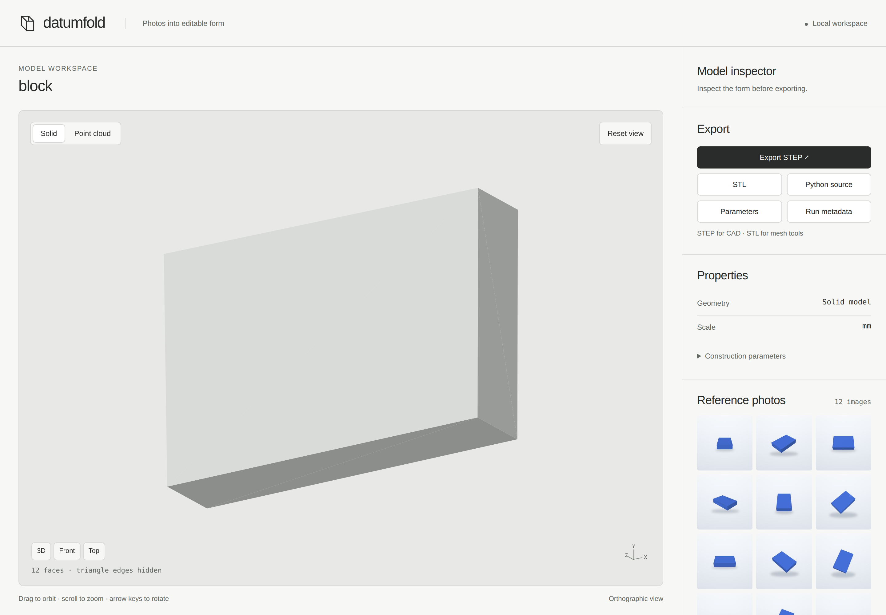
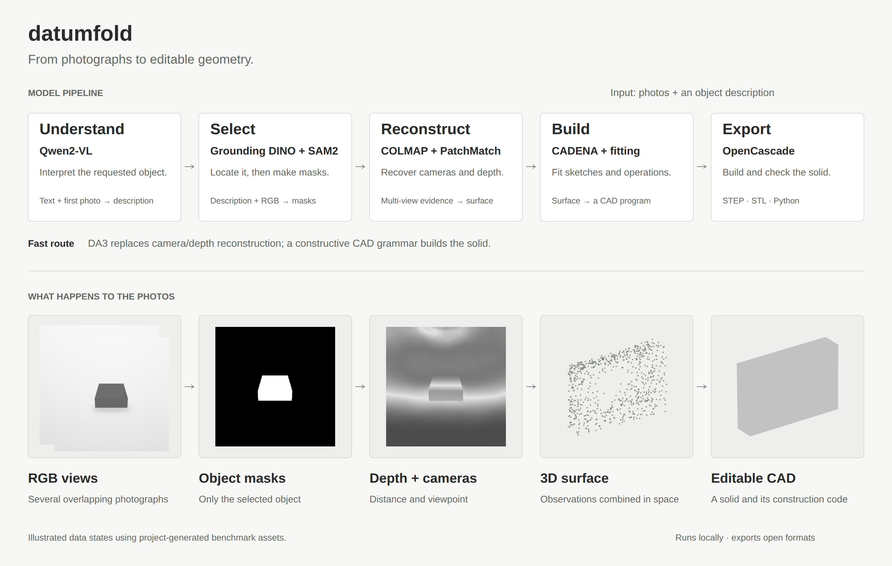

# Datumfold

**Turn photos of an object into editable CAD.** Describe the object, provide overlapping photos, and export STEP, STL and a CadQuery Python program.

[](https://github.com/dancher00/DA3-CAD/actions/workflows/ci.yml)
[](LICENSE)

## 1. Install

Linux, Python 3.12 and an NVIDIA GPU. Tested on an RTX 5080 with 16 GB VRAM.

```bash
git clone https://github.com/dancher00/DA3-CAD.git
cd DA3-CAD
```

Follow the **[one-time setup](docs/PHOTO_CAD.md#installation)** to install the environment and models. Weights download separately. The original `da3-cad` command also works.

## 2. Add photos and describe the object

Put **20–40 sharp, overlapping photos of the same stationary object** in `photos/`. Move the camera around it; keep the object still. At least three distinct images are required for reconstruction.

```bash
# Preview the object selection before reconstructing.
datumfold photo-cad photos/ --object "metal block" \
  --output work/selection --stop-after-masks --device cuda

# Generate CAD using the DA3 route.
datumfold photo-cad photos/ --object "metal block" \
  --output work/block --geometry da3 --device cuda
```

Use a **new output folder** for each run. Selection masks are in `work/selection/selection/masks/`. For calibrated reconstruction and source-view checks, see the [full MVS workflow](docs/PHOTO_CAD.md#calibrated-reconstruction).

## 3. Open the result

Open `work/block/candidate.step` in your CAD editor, or create a local browser preview:

```bash
datumfold viewer work/block/cad --output work/block/viewer.html
```

Open `work/block/viewer.html`. Drag to rotate, scroll to zoom, or select **Front**, **Top** and **3D**. Use **Export STEP** to open the model in your CAD editor.



*Workspace example from the controlled RGB benchmark. Input images and calibration are project-generated.*

| File | Contents |
|---|---|
| `candidate.step`, `.stl`, `.py` | STEP solid, preview mesh and editable program. |
| `model.step`, `.stl`, `.py` | Exports from an accepted MVS run. |
| `report.json` | Final decision, selected models and stage logs. |

## How it works



[Vector diagram](docs/assets/workflow/photo-to-cad.svg) · [Editable Excalidraw](docs/assets/workflow/photo-to-cad.excalidraw)

[Usage, setup & troubleshooting](docs/PHOTO_CAD.md) · [RaySection depth-to-CAD tool](docs/RAY_SECTIONS.md) · [Benchmarks](docs/BENCHMARKS.md) · [Image credits](docs/assets/quickstart/README.md)

Code: [Apache-2.0](LICENSE). Third-party models and example images have their own terms; see the [model notes](docs/PHOTO_CAD.md#model-licenses).
