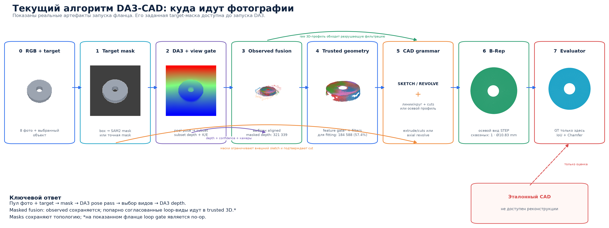

# Как работает DA3-CAD — визуально

## Короткий ответ: куда идёт фотография

В текущей реализации порядок такой:

**RGB pool + target → mask + общий crop → DA3 pose pass → adaptive views →
DA3 depth pass → pose/feature admission → observed/trusted/silhouette evidence →
grammar → B-Rep + provenance.**



Продукт предполагает, что пользователь или робот знает, какой экземпляр он
выбрал, но не обязан знать его класс или CAD-тип. По каждому виду он передаёт
box или точную mask. SAM2 превращает box в full-resolution mask, после чего один
общий размер crop сохраняет маску, реальный контекст и projective scale. Это
выполняется до DA3.

Legacy `internet-object` segmenter всё ещё может построить центральную маску
после DA3 по RGB/depth/confidence, но это convenience path только для простых
сцен, а не основной маршрут реальных объектов.

Mask определяет, какие пиксели принадлежат выбранному объекту. DA3 предоставляет
depth, confidence, intrinsics `K` и extrinsics `world_to_camera`. Они сходятся в
masked fusion; ни одного выхода отдельно недостаточно для CAD.

## Полный алгоритм

1. **Ввод и target.** Загружаются RGB-фотографии одного неподвижного объекта и
   per-view box либо mask выбранного экземпляра. EXIF исправляется, имена,
   дубликаты и качество записываются в provenance.

2. **Target preparation.** Box преобразуется SAM2 в mask; exact mask проходит без
   сегментационной модели. Все виды получают общий размер crop без per-view
   resize. Маска остаётся полной, а настоящий фоновой контекст сохраняет DA3
   информацию для depth и pose.

3. **DA3 pose pass и adaptive views.** DA3 совместно обрабатывает весь пул и
   возвращает предварительные камеры. Практически пустые masks отклоняются.
   Остальные направления жадно выбираются по приросту spherical coverage:
   минимум 24, максимум 40. Отчёт различает `sufficient`, `capped` и
   `exhausted`, а не считает число кадров доказательством покрытия.

4. **DA3 depth pass.** Если subset отличается от пула, выбранные кадры
   прогоняются через DA3 заново. Это обязательно: depth и pose DA3 зависят от
   совместного batch context, поэтому нельзя просто вырезать готовые карты
   глубины из первого прохода. Только второй prediction поступает в fusion.

5. **Исправление и допуск поз целыми ракурсами.** Для камер DA3 masked depth
   временно анпроецируется по каждому кадру. Грубый граф строится по робастным
   центрам и двунаправленному nearest-surface distance. Разорванный граф сначала
   получает только ограниченный translation consensus; отдельный pose-island
   может сравнить translation и trimmed SE(3), но обязан пройти held-out
   surface/mask/depth audit и полную повторную admission.

   Из того же прохода DA3 сохраняются плотные признаки layer 11, детерминированно
   сжатые до 64 измерений; без них используется SIFT. По фиксированным
   feature/depth correspondences уточняется joint bundle с одной неподвижной
   gauge-камерой. Fit matches, отложенные matches, RGB reprojection и независимые
   surface samples проверяются раздельно. Если сильный feature-граф распался на
   многокадровые группы, одна SE(3)-поправка применяется ко всей группе, не меняя
   относительные камеры внутри неё.

   Повторяемая внутренняя RGB-окружность с неплоской DA3 depth включает topology
   guard. Для осесимметричного тела surface-ICP может улучшить численную ошибку,
   но уничтожить согласование камер с отверстием; тогда refinement откатывается
   со статусом topology-guarded-abstention. RGB, masks, K и depth неизменны.
   Внешние калиброванные камеры весь шаг обходят. Это не TSDF/surfel fusion.

6. **Гипотезы глубины.** Исходная DA3 depth всегда сохраняется как `identity`.
   Дополнительно строится `fixed-local-plane` коррекция между видами. Она
   допускается только при полном overlap-графе, заметном уменьшении внутренней
   ошибки и небольших, не упёршихся в bounds поправках scale/center. GT здесь
   недоступен.

7. **Геометрия и три канала evidence.** Для каждого допустимого пикселя (u,v)
   берётся глубина z: p_camera = z · K⁻¹[u,v,1]. Затем обратная матрица
   world_to_camera переносит точку в общую мировую систему.

   Для повторяемого тонкого off-body loop дополнительно сравниваются
   hole-adjacent 3D-поверхности. В trusted 3D допускается крупнейшая группа
   ракурсов, где каждая пара укладывается в предел двунаправленного
   median-surface distance. Несогласованные ракурсы сохраняют 3D корпуса, но не
   создают дополнительные слои ручки. Камеры не двигаются и точки не
   достраиваются.

   - observed_cloud содержит все finite-positive depth-точки внутри target mask
     всех pose-admitted видов и используется для диагностики, но не напрямую
     для CAD fitting; поэтому на нём намеренно видны отвергнутые loop-гипотезы;
   - trusted_geometry сначала применяет feature-wise geometry masks, затем
     per-view confidence gate и последующие outlier/multi-view проверки;
   - исходные RGB, masks и dense depth остаются отдельным каналом границ и
     топологии. Дыра в mask является прямым evidence; если foreground-mask её
     заполнила, RGB-эллипс допускается только при отклонении внутренней depth от
     локальной плоскости окружающего кольца.

   Поэтому «слитое облако» — конкатенация наблюдений всех кадров, а не
   усреднённая картинка и не CAD. Низкоуверенные boundary-depth точки видны в
   observed, но не могут заполнить отверстие во fitter. Решение feature gate
   записывается в `loop_feature_admission.json`, а реально использованные
   support-маски — в `geometry_mask_*.png`.

8. **CAD-aware выбор.** Для безопасных `identity` и `aligned` кандидатов текущая
   sketch-extrusion грамматика измеряет P90 расстояния наблюдений до лучшей
   поверхности экструзии. Выигрывает минимальный residual; при равенстве —
   `identity`. На benchmark это выбирает aligned для блока/фланца и identity для
   L-профиля.

9. **Покрытие камер.** Из world_to_camera вычисляются центры камер и
   направления от объекта к камерам. Алгоритм считает угловые кластеры,
   максимальное разделение ракурсов и spherical coverage. Если ракурсов
   недостаточно, отчёт предлагает направления следующих снимков. Количество
   кадров само по себе не считается покрытием: 16 соседних кадров могут
   образовать четыре эффективных направления.

10. **Canonicalization.** После единственного confidence-gate в trusted geometry облако
   проходит удаление выбросов, проверку поддержки несколькими видами,
   определение симметрии, устойчивую ориентацию, выборку точек и изотропную
   нормализацию. Повторный percentile confidence-filter по умолчанию выключен:
   раньше два последовательных фильтра оставляли около 36% исходных masked
   depth-точек и разрушали тонкие признаки. Масштаб хранится отдельным каналом.

   При этом исходное fusion-облако не уничтожается. Фильтрованное облако служит
   только для ориентации и surface residual; все исходные наблюдения остаются
   отдельным 2D profile evidence. Для почти совпавшей PCA-оси принятая плоскость
   симметрии может точно зафиксировать направление.

11. **CAD grammar.** Backend не выбирает класс детали, а сравнивает операции.
   Ветка `extrude` проверяет три canonical-оси и строит 2D line/circle profile.
   Для полилиний silhouette consensus может обрезать профиль только при согласии
   с raw 3D. Круглый cut требует либо повторяющейся замкнутой области в masks,
   либо повторяемого RGB-эллипса, внутри которого DA3 depth не объясняется
   локальной плоскостью. Calibrated rays переносят его на торец; совпадающая raw
   3D-пустота остаётся предпочтительным измерением центра и радиуса.
   Нарисованный круг на плоской depth не меняет топологию. Длина экструзии
   уточняется по боковым calibrated
   silhouettes с 3D-длиной как prior. Шумная ортогональная полилиния заменяется
   общей сеткой horizontal/vertical линий только если она сохраняет исходный
   профиль и улучшает end-view masks. Наконец, небольшой rigid-поворот готового
   CAD допускается только при достаточном all-view silhouette gain; решение на
   границе поиска отвергается. Эти правила не знают названий U/T/hex.

   Ветка `revolve` сначала проверяет raw 3D radial surface вдоль каждой оси. Если
   все оси отвергнуты из-за частично видимой поверхности, внешний осевой профиль
   можно агрегировать из нескольких masks. Такой fallback требует малой вариации
   width ratio, малой ошибки bilateral axis и малого profile deviation.
   Внутренний профиль берётся из видимой raw 3D-стенки либо из повторяемой пары
   внутреннего RGB-эллипса и большего концентрического торцевого обода. Во втором
   случае depth внутри эллипса обязана нарушать локальную плоскость, radius ratio
   должен повторяться, а камеры — смотреть вдоль оси. Каждый обод привязывается
   к одному из двух концов силуэта; затем сравниваются `solid`, две ориентации
   глухой полости и `through`. Сквозное отверстие допускается только при
   поддержке обоих концов достаточно разнесёнными направлениями камер. Иначе
   остаётся минимальная глухая или неоднозначная полость. Невидимые азимуты отмечаются как CAD-гипотеза.
   Для ступенчатых тел общий fitter ищет два повторяющихся radial
   plateau и две axial shoulder, затем уточняет их положение по боковым masks.
   Smooth-профиль не превращается в ступенчатый без этого совместного evidence.

   После дискретного выбора топологии допускается bounded CAD-conditioned
   refinement. Сначала уточняется только глобальный наклон CAD, затем scale и
   axial offset; тип `solid/blind/through` остаётся неизменным. Оптимизация
   использует исходные masks и фиксированную DA3-поверхность, а не повторный DA3
   на собственном рендере. Она не запускается при слабой baseline-проекции,
   откатывается на границе search, при ухудшении любого view или 3D residual.
   Сильный end taper также не выпрямляется без достаточной идентифицируемости:
   реальный shaft показал, что mask score способен улучшаться за счёт
   компенсации ошибочной камеры, одновременно ухудшая post-hoc CAD metric.

   Ветка `axial-shell-loop` не называет объект кружкой. Она морфологически
   отделяет толстый осевой корпус от тонкого appendage, требует повторяющееся
   боковое отверстие петли, подтверждает открытую полость перепадом DA3 depth и
   измеряет пару RGB-кромок обода. В сильнейшем боковом силуэте отдельно
   измеряются far/top/bottom толщины петли, а near-axial вид измеряет её
   front-back depth. Если variable-band профиль проходит bounds, silhouette IoU
   и сравнение с круглым baseline, строится программа
   `revolve -> shell -> profile-extrude -> fillet -> union -> cut(cavity)`.
   Постоянный круглый sweep теперь только явно отмеченный fallback при
   недостатке evidence. CAD-kernel отдельно проверяет открытое отверстие ручки,
   положительное перекрытие с корпусом и отсутствие проникновения в полость.
   Для независимо обрезанных интернет-фото
   несогласованные позы DA3 не используются для ложного поворота STEP: CAD
   остаётся в чистой локальной системе, а 3D surface provenance помечается
   `unavailable` до CAD-conditioned уточнения камер.

   Если ни extrude, ни revolve, ни axial-shell-loop не объясняют вход, результат
   — явный `unsupported`, а не ближайший шаблон. Принятый простой B-Rep
   поворачивается обратно в систему камер только когда такой transform надёжен.

   При надёжном CAD-to-camera transform surface samples проецируются обратно во
   все кадры и
   получают provenance measured, weakly measured, unobserved или contradicted.
   Достраивание разрешается только при недостаточном pose coverage, наличии
   реально unobserved поверхности и отсутствии чрезмерного противоречия видимым
   данным. Достроенные грани не называются измеренными.

12. **B-Rep.** Из параметров создаётся редактируемая программа CadQuery. Она
   выполняется в отдельном ограниченном процессе, проверяется на один валидный
   solid и экспортируется в STEP/STL.

13. **Evaluator.** Эталонный CAD открывается только после завершения
   реконструкции. Он используется для IoU и Chamfer и никогда не участвует в
   DA3, сегментации, fusion или подборе CAD.

## Что происходит на текущем benchmark


| Деталь | Что видно по стадиям | Итог |
|---|---|---|
| Сплошной блок | aligned depth, четыре граничные линии | sketch-extrusion без ложного отверстия, IoU 87.99% |
| Фланец | маски подтверждают cut, raw 3D-профиль измеряет его | Ø10,83 мм при GT Ø12 мм, IoU 91.82% |
| L-кронштейн | identity + symmetry axis + raw 3D ∩ силуэты | 20 линий + extrude без класса L, IoU 89.24% |

Столбцы Observed masked depth и Trusted geometry — каналы с разными
обязанностями, а не обещание, что правая картинка обязана выглядеть плотнее.
В каждом окне отрисовано не более 80&nbsp;000 точек, а полные количества указаны
под облаками. Для фланца это 321&nbsp;339 observed-точек, 192&nbsp;803
confidence-gated profile-точки и 184&nbsp;588 trusted surface-точек. Все
сравниваемые облака показаны в одной DA3 world frame одной виртуальной камерой.

B-Rep показан двумя способами. Осевой вид смотрит вдоль восстановленной оси
экструзии и поэтому явно показывает сквозную топологию; перспектива показывает
сам solid. У фланца STL watertight, genus&nbsp;1, одно сквозное отверстие.
Маски отвечают только на вопрос, существует ли cut. Центр и радиус берутся из
совпадающей замкнутой пустоты raw 3D-профиля. Поэтому диаметр фланца вырос с
mask-only 6,55&nbsp;мм до 10,83&nbsp;мм при эталонных 12,00&nbsp;мм.

На L-кронштейне визуальное замечание о фильтре подтвердилось численно:
evaluator-only IoU 2D-профиля равен 0,745 для raw и только 0,655 после фильтров.
Но полное отключение multi-view consistency ухудшает 3D IoU до 63,00%.
Поэтому фильтры не удалены, а лишены права определять финальный контур:
ориентация и surface score берутся из filtered cloud, профиль — из
`raw 3D ∩ silhouettes`. Evaluator-only ablation выбрал консенсус 7/8 и
упрощение 0,004; полный reconstruction затем не получал эталон. Это даёт 20 линий,
повышает mesh IoU с 72,06% до 89,24% и снижает CD²×1000 с 1,2098 до 0,3303.

Первая версия этого рисунка справедливо выглядела неправильно: генератор делал
ортографические кадры и независимо вписывал каждый ракурс в рамку, а DA3
восстанавливал перспективные камеры. Поверхности разных видов образовали
разнесённые «лепестки». Эти результаты отменены. Текущий benchmark использует
фиксированную pinhole-оптику и передаёт DA3 точные `K` и
`world_to_camera` в миллиметрах.

Это важное разделение ошибок:

- DA3 отвечает за depth и камеры, но не за CAD-топологию;
- segmentation отвечает за принадлежность пикселя объекту;
- fusion отвечает за наблюдаемую 3D-геометрию;
- canonicalizer отвечает за устойчивую систему координат;
- CAD backend отвечает за распознавание инженерных примитивов и топологии;
- evaluator только измеряет результат.

## Воспроизведение картинок

Сначала должны существовать три локальных benchmark-запуска в
`outputs/benchmark_block_sketch_v8`,
`outputs/benchmark_flange_sketch_v9` и
`outputs/benchmark_l_bracket_sketch_v9`. Затем:

```bash
python scripts/render_benchmark_pipeline.py
```

Скрипт создаёт:

- `docs/assets/benchmark_pipeline/algorithm_flow_ru.png`;
- `docs/assets/benchmark_pipeline/benchmark_stage_grid.png`;
- `docs/assets/benchmark_pipeline/metadata.json`.

Картинки используют сохранённые RGB, depth, masks, point clouds, полученные CAD
и evaluator metrics. Нарисованных или подменённых промежуточных стадий нет.

Общий публичный benchmark на 10 деталях и 120 изображениях включён в
[`DA3-CAD_public_benchmark_v2.pdf`](DA3-CAD_public_benchmark_v2.pdf).
