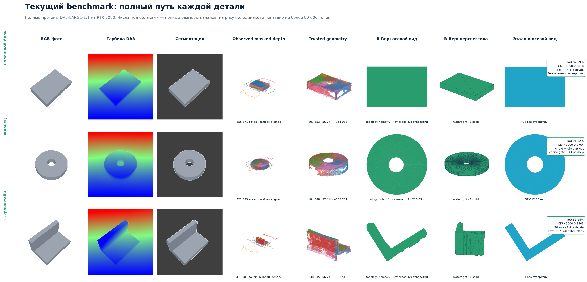

# Typical-parts benchmark v1

The benchmark contains three deterministic parts. Each case contains eight
perspective RGB views, an exact pinhole camera bundle,
evaluator-only ground-truth STEP/STL, exact parameters and a manifest under
`sample_data/benchmark/`. The cameras have fixed `f=180 px`, a `130 mm`
camera distance and known millimetre scale.

| Part | Ground truth | DA3-CAD output | STEP | IoU | CD²×1000 |
|---|---|---|---:|---:|---:|
| Solid block | 48×32×10 mm | 4-line sketch + extrusion, no invented hole | valid | 87.99% | 0.3818 |
| Flange | Ø44×8 mm, Ø12 through-hole | circle + mask-gated, 3D-measured circular cut + extrusion | valid | 91.82% | 0.2764 |
| L-bracket | 50×32×28 mm, 6 mm walls | 20-line raw-3D/silhouette sketch + extrusion | valid | 89.24% | 0.3303 |

The benchmark guards against a false-positive hole on the solid block:
point-cloud voids cannot create a CAD hole when multi-view RGB masks contain no
enclosed aperture. The calibrated run recovers the flange body and hole
topology; views 4–7 independently support the cut. All three parts use
`construction-grammar-v1`, which evaluates both `extrude` and `revolve`. It
selects `extrude` for every case and rejects `revolve` because the measured
radial-symmetry score is below its gate. The resulting STL files are byte-for-byte
identical to the last sketch-extrusion regression outputs.

There is no block, flange or L-bracket class: the selected family recovers an
extrusion axis and a line/circle profile, then emits a CadQuery sketch. Product
profiles retain identity depth and one
fixed-local-plane aligned hypothesis. Alignment must first pass conservative
observation-only gates. The construction grammar then compares normalized
extrusion-surface residuals plus a small raw-profile preservation loss and
selects aligned depth for the block/flange and identity for the L-bracket. Raw
fused observations remain available as profile evidence even though the
denoised surface cloud drives orientation and residual scoring. For polygonal
profiles, raw occupancy is intersected with a seven-of-eight multi-view
silhouette consensus when that consensus agrees with raw 3D. An accepted
reflection normal also snaps a nearly coincident PCA axis. The remaining L
error is contour noise and missing line constraints, not a forced
primitive-class choice.

## Visualization contract

The report shows both geometry channels instead of presenting filtering as a
single monotonic improvement:

- **Observed masked depth** contains every finite positive DA3 depth pixel inside
  target masks. It is diagnostic evidence and is not used directly for fitting.
- **Trusted fusion** applies the confidence gate and remains available as raw
  profile/aperture evidence.
- **Trusted geometry** is the outlier/multi-view-consistent subset used for
  orientation and surface residuals. Filtering does not replace or delete
  observed evidence.
- **Silhouette consensus** projects an extrusion candidate into all input
  masks and keeps profile cells supported by the configured consensus. The
  current L-bracket run requires seven of eight views. It may trim raw occupancy, but only after a raw/silhouette agreement gate.

The user's visual diagnosis was correct: for the L-bracket, an evaluator-only
profile ablation measures IoU 0.745 for raw occupancy but only 0.655 for the
filtered occupancy. The filters remove real boundary evidence together with
outliers. Simply disabling them is not the fix: a full no-consistency run drops
3D mesh IoU to 63.00%. Splitting responsibilities is the fix. Filtered points
still stabilize orientation and surface scoring, while the final profile uses
raw 3D intersected with silhouettes (profile IoU 0.832 in the evaluator-only
ablation).

Synthetic and real-object cloud panels now draw up to 80,000 points and report
both the full count and displayed fraction. Compared point channels stay in the
same DA3 world frame and use the same virtual camera. B-Rep output is shown twice: an axial
view along the recovered extrusion axis makes through-holes visible, while a
canonical perspective view shows the solid. The flange STL is one watertight
genus-1 solid with one through-hole. Repeated mask voids confirm the cut, but
the matching raw 3D-profile void measures it. Its recovered diameter is
10.83 mm versus the 12.00 mm reference (9.76% low).



An earlier draft of these fixtures used orthographic projection and resized
every view independently. That image sequence was incompatible with DA3's
perspective camera model and produced visibly duplicated point-cloud sheets.
Those metrics were invalidated and replaced by the calibrated protocol above.

These are three integration cases, not a statistically meaningful benchmark.
The exact machine-readable ledger is
[`results/typical-parts-v1.json`](results/typical-parts-v1.json).

## Reproduce fixtures

```bash
python scripts/build_benchmark_cases.py
pytest -q tests/integration/test_sample.py
```

## Reproduce a DA3 run

```bash
da3-cad reconstruct sample_data/benchmark/block/views \
  --output outputs/benchmark-block \
  --config configs/photo_geometric.yaml \
  --cameras sample_data/benchmark/block/cameras.npz \
  --accept-noncommercial-weights

da3-cad evaluate outputs/benchmark-block/model.stl \
  sample_data/benchmark/block/gt.stl \
  --item-id benchmark-block-sketch-v8 \
  --output outputs/benchmark-block/reference_metrics.json
```

All three reconstructions receive exact world-to-camera matrices from the
fixture and therefore carry camera-derived millimetre scale. Ground-truth CAD
remains evaluator-only and is never visible to DA3, segmentation, fusion or the
CAD backend.

## Licensed real-object integration gate

Five pinned Google Objectron videos test the target-first product path. Each
case supplies a 40-frame pool. Projected 3D boxes are only localization prompts
for SAM2; no category label enters the CAD grammar. A full-pool DA3 pose pass
feeds mask-quality and viewpoint-diversity selection, followed by a fresh DA3
depth pass on the selected subset.

| Source sequence | Pool → reconstruction | Trusted points | Result |
|---|---:|---:|---|
| `book/batch-47/25` | 40 → 24 | 759,579 | **ACCEPT** · extrude |
| `bottle/batch-16/11` | 40 → 40 | 946,138 | STEP candidate · **UNSAFE** |
| `camera/batch-1/0` | 40 → 40 | 1,556,557 | **ABSTAIN** |
| `cup/batch-1/0` | 40 → 40 | 1,609,105 | **ABSTAIN** |
| `laptop/batch-34/40` | 40 → 39 | 1,141,783 | **ABSTAIN** |

The selector processes 200 pool images and sends 183 to reconstruction. Book
passes pose and surface gates (68.73% measured, 9.68% contradicted). Bottle
exhausts all 40 views at 86.4° maximum separation and remains unsafe with
42.42% contradicted surface. Camera and cup exhaust their videos without a
supported grammar program. Laptop rejects one near-empty SAM2 mask and still
exceeds the extrusion residual gate (0.1721 > 0.0800); the larger pool therefore
removes the previous false coarse-extrusion candidate. Additional views produce
no new ACCEPT result and demonstrate that pose diversity must not substitute
for post-CAD surface evidence.

There is no reference CAD, measured physical scale or accuracy metric for these
five cases. “Valid STEP” means only that one finite positive-volume B-Rep passed
the exporter contract. The exact ledger is
[`results/real-photo-v3.json`](results/real-photo-v3.json).

The checked-in public PDF shows all ten release fixtures and their complete
outcomes. After the licensed local captures and runs exist, regenerate the
private five-object ledger and inspection grid with:

```bash
python scripts/build_real_photo_ledger.py
python scripts/render_real_object_benchmark.py
```

Open `outputs/real-photo-release-v6/benchmark_grid.png`. It contains prepared
RGB, SAM target, DA3 depth, observed masked depth, trusted geometry, measured
pose coverage and the validated CAD outcome or explicit abstention. The image
remains ignored because it embeds Objectron-derived imagery.

After accepting the dataset license and reproducing the local runs, render the
complete six-column inspection grid with:

```bash
