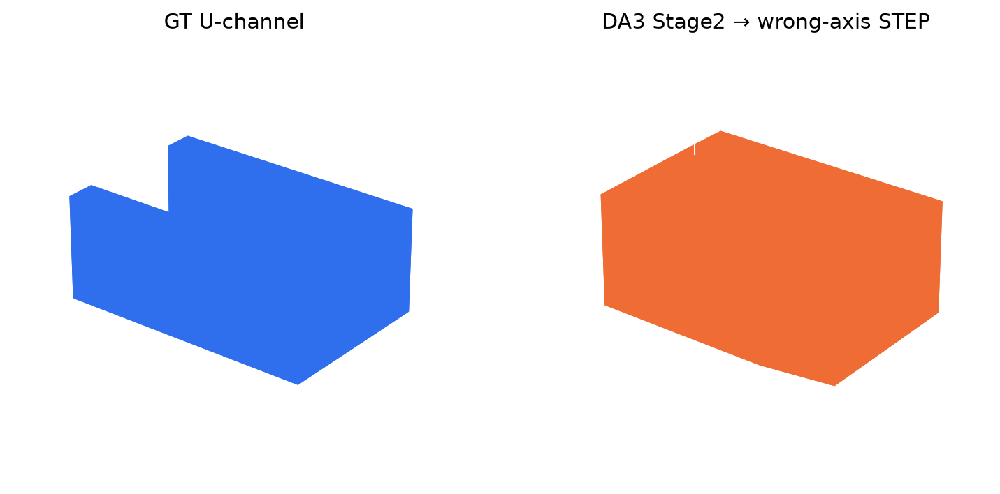
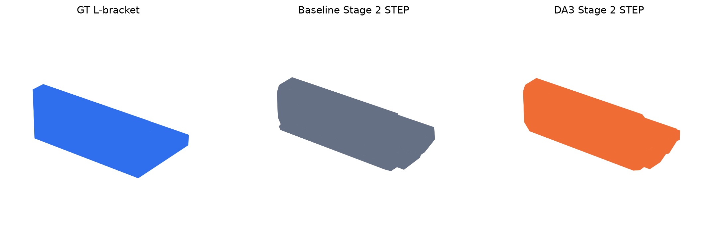

# BrepGaussian + DA3 experiment

This is an experimental bridge, not the default DA3-CAD reconstruction path.
BrepGaussian remains an external project: DA3-CAD does not vendor its source or
weights. At the time this bridge was added, the upstream root repository did not
declare a reusable software license, while its Gaussian rasterizer carried the
Graphdeco non-commercial research terms. Review upstream terms before running it.

The tested integration changes DA3's role. Calibrated cameras still come from the
dataset or SfM. BrepGaussian optimizes its 2D Gaussian surface. DA3 supplies only a
per-view depth prior and confidence map:

```text
calibrated RGB + masks/edges ──> BrepGaussian Stage 1 ──> dense labelled surface
             │                         ▲
             └─> DA3 depth/confidence ─┘  robust, confidence-weighted loss
```

The loss is intentionally not a plain depth L1. It normalizes confidence per
view, can attenuate image discontinuities, aligns scale in log-depth, rejects
large inconsistent residuals using detached robust statistics, and also compares
local depth gradients. DA3 therefore regularizes weakly observed areas without
becoming the source of cameras or an unconditional geometric measurement.

## Export the prior

With the pinned DA3 source and Base weights already prepared:

```bash
python scripts/prepare_brepgaussian_da3_prior.py \
  /path/to/object/transforms_train.json \
  /tmp/object-da3-prior.npz \
  --views 10 \
  --checkpoint base \
  --source-dir data/upstream/Depth-Anything-3 \
  --cache-dir data/hf
```

The exporter uses the exact supplied cameras and greedily selects views by
spherical coverage. It writes a versioned NPZ plus a JSON provenance report.
DA3 Base is the permissive default; non-commercial DA3 checkpoints require the
existing explicit acceptance flag.

## Add the loss to an external training loop

Load the bundle once:

```python
from da3_cad.integrations.gaussian_depth_prior import DepthPriorBundle

depth_prior = DepthPriorBundle.load(prior_path)
```

For the selected camera, resize the matching prior to the rendered depth and add
the robust term:

```python
from da3_cad.integrations.gaussian_depth_prior import confidence_aware_depth_prior_loss

prior_depth, prior_confidence = depth_prior.torch_view(
    viewpoint_cam.image_name,
    height=render_pkg["surf_depth"].shape[-2],
    width=render_pkg["surf_depth"].shape[-1],
    device=render_pkg["surf_depth"].device,
)
prior_terms = confidence_aware_depth_prior_loss(
    render_pkg["surf_depth"],
    prior_depth,
    prior_confidence,
    foreground_mask=(gt_image.abs().sum(dim=0, keepdim=True) > 1e-3),
)
total_loss = total_loss + depth_prior_weight * prior_terms.total
```

Start with a small weight such as `0.02` and activate it after the photometric
warm-up. For every configuration run 3–5 genuine optimization seeds and keep
the seed paired between:

1. BrepGaussian baseline;
2. naive unweighted depth L1 (negative control);
3. the confidence-aware DA3 prior above.

The overlay exposes `--seed` because upstream `safe_state()` otherwise fixes
the training RNG to zero. Report geometry and disjoint held-out rendering
metrics separately. Fitted-view PSNR is diagnostic only; it is not evidence
that CAD geometry improved.

## Admission is experimental and opt-in

Create a matched sparse-view dataset from exported prior metadata:

```bash
python scripts/prepare_nerf_view_subset.py \
  /path/to/object/transforms_train.json \
  /tmp/object-5views \
  --prior /tmp/object-da3-prior.npz
```

Apply the hook to a disposable external checkout:

```bash
python scripts/enable_brepgaussian_da3_prior.py /path/to/BrepGaussian
```

The command writes a `.da3-cad-original` backup and refuses to patch twice.
Patched Stage 1 accepts `--seed`, `--depth_prior`,
`--enable_depth_prior`, `--depth_prior_weight`,
`--depth_prior_start` and `--depth_prior_max_coverage`.

The prior is off unless `--enable_depth_prior` and `--depth_prior` are both
passed. The optional coverage limit defaults to `None`: there is no validated
coverage constant. Passing a limit is an explicit hypothesis test; missing
coverage metadata then disables the prior.

## Multi-seed result

The first strict test used five project-generated Apache-2.0 CAD fixtures.
Each object had five fitted views, four disjoint held-out views, coverage
`0.4155`, three paired optimization seeds and a ground-truth STL visible only
to the evaluator. Together with the direct repeat on official `00000699`, this
is 36 Stage 1 runs at 3000 iterations.

| Object | GT Chamfer change | GT p95 change | Held-out foreground PSNR | Held-out silhouette IoU |
|---|---:|---:|---:|---:|
| block | −1.81% (uncertain) | −1.99% (uncertain) | −0.068 dB | −0.43 pp |
| flange | +0.83% (uncertain) | +2.73% (uncertain) | −0.023 dB | −0.02 pp |
| L bracket | **−10.84%** | −7.25% (uncertain) | −0.017 dB | **+2.00 pp** |
| stepped shaft | −3.21% (uncertain) | **−10.74%** | −0.028 dB | +0.19 pp |
| U channel | **−15.44%** | **−18.26%** | **+1.203 dB** | **+1.67 pp** |

Bold cells have a paired 95% interval excluding zero in the favorable
direction. “Uncertain” means that three seeds do not establish the sign of the
effect. The flange is a negative control: DA3 did not produce a supported gain.

The old single-seed official pilot reported a 3.35% proxy-Chamfer improvement.
Its logged seed 7 controlled DA3 export, not BrepGaussian optimization; upstream
`safe_state()` still fixed the training RNG to zero.
That number did not replicate. Across three genuine optimization seeds, the
baseline proxy varied by 62.9%; per-seed DA3 changes were +0.69%, −32.21% and
+6.29%, and the paired interval crossed zero. Official held-out foreground PSNR
also had no supported gain. Therefore `0.65` is not a justified admission
threshold and is no longer a default.

The compact per-seed ledger is
[brepgaussian-da3-multiseed-v1.json](results/brepgaussian-da3-multiseed-v1.json).
The earlier [single-seed pilot](results/brepgaussian-da3-pilot.json) is retained
as provenance and explicitly marked superseded.

## Reproduce the strict test

Adapt any fixture from the public benchmark into disjoint fitted/held-out
BrepGaussian data:

```bash
python scripts/prepare_brepgaussian_fixture.py \
  sample_data/public_benchmark_v2/u_channel \
  /tmp/brep-u-channel \
  --train-views 5 --held-out-views 4
```

Export its DA3 prior, then run paired seeds:

```bash
python scripts/run_brepgaussian_seed_sweep.py \
  /path/to/BrepGaussian \
  /tmp/brep-u-channel \
  /tmp/brep-u-channel/da3-prior.npz \
  /tmp/brep-u-channel-sweep \
  --reference-mesh /tmp/brep-u-channel/evaluator_only/reference_mesh.ply \
  --seeds 0 1 2
```

Aggregate one or more sweep directories with
`scripts/summarize_brepgaussian_seed_sweeps.py`. The evaluator keeps fitted and
held-out metrics in separate JSON fields and can never silently substitute one
for the other.

## End-to-end topology pilots

Before launching the 180-run confirmatory sweep, one paired seed was continued
through Stage 2 and the DA3-CAD grammar on an RTX 5080. Stage 2 fit comfortably
in 16 GB and took about seven to eight minutes per configuration. These were
upper-bound tests: the five fitted views used oracle CAD face masks.

### U channel

| Evidence | Baseline | DA3 prior |
|---|---:|---:|
| Stage 2 merged points | 6,962 | 8,982 |
| Stage 2 labels | 12 | 13 |
| Deduplicated fitted planes | 10 | 10 |
| Correct-axis extrusion P90 | 15.16% | 12.74% |
| Correct-axis product decision | ABSTAIN | ABSTAIN |

DA3 reduced the correct longitudinal-axis residual by 15.95%, but both results
remain above the frozen 8% CAD gate. When all axes were left unconstrained, the
DA3 case emitted a mathematically valid solid on the wrong axis: 45.80% IoU,
88 faces and 258 edges, versus 10 faces and 24 edges in the reference. The
baseline's wrong-axis profile self-intersected and failed solid validation.



A label-aware plane-RANSAC ablation did not rescue the U topology. Stage 2 had
fragmented the end cap and failed to preserve all required side-patch
correspondences. Therefore a count of ten fitted planes was not evidence of a
correct B-Rep. The full ledger is
[brepgaussian-da3-u-channel-end-to-end-v1.json](results/brepgaussian-da3-u-channel-end-to-end-v1.json).

### L bracket

The same Stage 2 test was then repeated on the L bracket. This time both variants
selected the correct longitudinal axis and passed the 8% raw surface-residual
gate, but both emitted valid, wrong STEP solids.

| Evidence | Baseline | DA3 prior | Reference |
|---|---:|---:|---:|
| Stage 2 merged points | 10,419 | 10,536 | — |
| Oracle face identities / Stage 2 labels | 8 / 12 | 8 / 12 | 8 faces |
| Deduplicated fitted planes | 9 | 9 | 8 faces |
| Correct-axis extrusion P90 | 5.20% | 5.71% | ≤8% gate |
| STEP IoU | 57.92% | 57.57% | 100% |
| STEP Chamfer squared ×1000 | 3.657 | 3.242 | 0 |
| STEP faces / edges | 48 / 138 | 40 / 114 | 8 / 18 |

DA3 reduced Chamfer by 11.34% and made the profile somewhat simpler, but worsened
P90 by 9.86% and IoU by 0.35 percentage points. More importantly, the input
oracle masks contained exactly eight global CAD face identities while Stage 2
produced twelve labels in both configurations. The correspondence/merger is
therefore fragmenting physical faces before the CAD grammar sees them.



The full ledger is
[brepgaussian-da3-l-bracket-end-to-end-v1.json](results/brepgaussian-da3-l-bracket-end-to-end-v1.json).

## What remains before a paper claim

The Stage 1 test supports “DA3 can help some sparse CAD geometries”; it does not
support a universal prior or a coverage gate. The U-channel and L-bracket pilots
show the same upstream defect on two concave prismatic objects: Stage 2 does not
preserve global face identity, adjacency and closed profile loops. The larger
180-run prior sweep should therefore not start yet.

The next milestone is a topology-aware Stage 2 contract: merge patches using
multi-view face identity and adjacency, construct closed profile loops, and add
a provenance gate for unexplained patch fragmentation or excessive B-Rep
complexity. Kernel validity and the current raw surface-residual gate are not
sufficient: the L bracket passed both while containing five to six times too
many faces. Only after both paired pilots produce the correct longitudinal STEP
should the experiment vary coverage, objects and seeds.

The next confirmatory experiment was frozen before execution in
[DA3_PRIOR_SHAPE_HYPOTHESIS.md](experiments/DA3_PRIOR_SHAPE_HYPOTHESIS.md).
